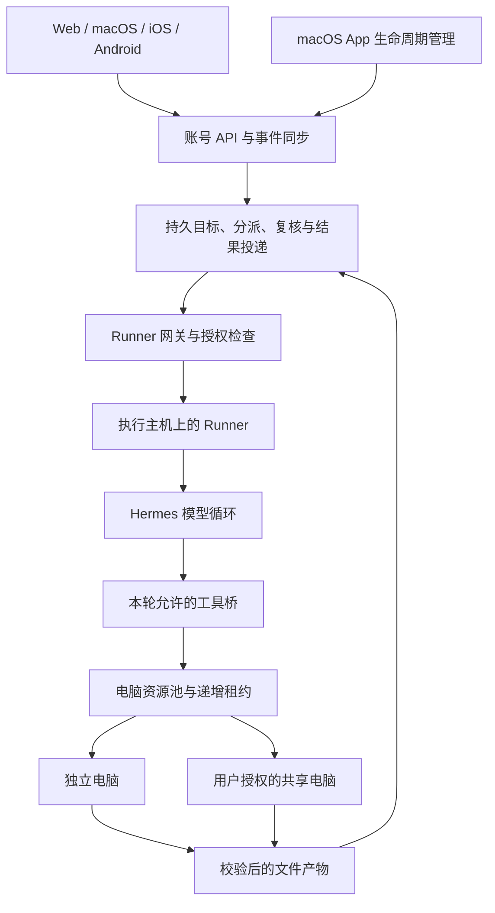

# Bot 自主组队、电脑环境与 macOS App 完整方案

## 结论与仓库安排

Bot 模式可以让获得授权的管理员 Agent 创建持久成员、建立团队、分派任务，也可以按目标创建临时助手。任务调度、权限和结果由服务端持久保存。macOS App、Web 控制面、Runner 和电脑 Provider 均放在 `hermes-yaoyao`，分支为 `feat/bot-agent-teams`；iOS 和 Android 的协议入口在各自仓库维护。

App 打开时启动或连接本地 Web 服务，按配置启动 Runner，检测并托管缺少的本地 Hermes 服务。关闭窗口保留执行；明确退出仅停止自己的进程。已有外部服务保持其原版本与生命周期，不会被新 App 静默替换。

## 两个参考项目的取舍

| 参考实现 | 吸收的部分 | 本方案的具体选择 |
|---|---|---|
| OpenMausBot `server/container-computer.ts` | 不可变镜像、每 Bot 环境、工作目录持久化、驱动健康检查、guest CUA | 采用兼容的 CUA 0.20.0 接口；独立配方随本仓库交付；guest 无外部网卡、不发布 VNC 端口 |
| OpenMausBot 镜像配方 | 固定基础镜像与驱动/字体 SHA-256、浏览器资料目录 | 派生配方按 Apache-2.0 保留来源与许可证，增加夭夭标识和 Firefox 持久资料 |
| Rakazo `apps/api/src/team-chat-startup.ts` | 启动缓冲有上限、持久接收/唤醒归属、关闭等待有界 | 控制面保留投递、去重、任务归属、取消状态与恢复代次；结果回到原会话 |
| Rakazo `packages/core/src/screen-lease.ts` | 递增 fence，旧操作者无法覆盖新操作者 | 电脑租约持久化；人工接管等待在途工具结束，转交同一电脑并递增代次 |
| Rakazo `0008_team_computers` 数据迁移 | 电脑资源独立于 Bot，区分独立和团队电脑，执行/控制归属独立 | 默认独立电脑；用户明确授权后才能共享；临时助手不能加入共享电脑 |
| Rakazo 团队桌面测试 | 独立浏览器资料、持久化、旧查看/控制 token 拒绝 | 多个独立电脑可并行；共享电脑输入串行，跨端统一控制凭据与画面版本 |

没有改动两个参考仓库。Rakazo 的同一容器多个桌面并非本实现：这里的多桌面来自不同独立电脑；同一可信共享电脑只有一个桌面。共享成员知道它们会共用浏览器登录资料。

## 系统结构

六个对象必须分开：Profile 是模型与能力配置；Agent 是持久身份；团队是成员与角色关系；目标/子任务记录责任和验收；Runner 是执行主机；电脑是可复用资源。聊天会话和窗口都不是任务调度器。

## 自主组队与任务闭环

- 用户对某个 Agent 开启“管理团队”权限。每轮都重新核对，创建的成员默认不继承这个权限。
- 管理员先创建团队和目标，再提交负责人、依赖、验收条件与输入资料。Agent 可调整计划，但不能把“模型停止输出”当作目标完成。
- 成员完成后进入复核；管理员接受、返工、等待用户或标记受阻。成功与失败都有结构化结果和产物归属，自动回传原会话。
- 忙碌时结果排队。投递持久化并去重；重启核对已有执行，不重放结果不确定的命令。
- 临时助手绑定目标及其当前恢复代次，固定使用隔离电脑。结束、删除或换代后退役，清理固定原 Runner；原会话和已导出产物保留。
- 归档、停止、撤权后旧任务不能自动复活。用户的新指令才允许重新授权恢复。

当前限制：每队 2–8 人；账号最多 100 个有效 Agent、20 个有效团队；每个目标最多 32 个子任务；临时助手最多 8 个同时有效、32 个累计；每次授权最多 3 次任务尝试、8 次自动唤醒。同一 Agent 串行，全局最多 4 个执行槽。

## 电脑与人工接管

Runner 默认最多同时运行 2 台电脑，可配置 1–8 台；默认最多保存 32 个环境记录。资源在启动前预占，停止无法确认时保持占用。环境使用完整镜像 ID，校验账号、Runner、容器标签、挂载、网络、UID、CPU、内存与进程上限。

模型循环位于 Runner 主机，模型密钥通过私有进程通道传入；终端、文件、浏览器、电脑动作及其子进程在 guest 中执行。关闭原生宿主工具和二次委派出口，能力不足明确报错。Profile 的 cwd 在 guest 中映射为私有工作区的路径，不代表挂载宿主的整个项目目录；资料通过附件、guest 下载和产物导出流转。

默认 guest 没有外部网络。可选公网代理只允许公共地址的 80/443，拒绝内网、宿主、保留地址及混合 DNS 结果。浏览器和命令使用同一受控代理；这不是任意内网网络访问能力。

电脑面板默认只读。人工接管暂停模型，等待已提交工具结束，再转交同一容器；后台浏览器等应用保持运行。输入必须携带本页面凭据、当前代次和近期画面 ID。控制有效期 30 秒，前台续期；断开或撤权后停止，不自动恢复。交还说明进入原任务的新模型段，保留工作标识及已经执行的工具结果。

## 数据、更新与恢复

- 控制面：账号、Agent、团队、目标、子任务、投递、产物与 Runner 注册信息。
- Runner：私有配置、执行回执、Worker 会话、电脑租约和本机工作区。App 使用系统加密保存 Runner 配置。
- 独立电脑持久文件和浏览器资料各自保留；可信共享电脑共享这些数据，但成员的模型会话历史独立。
- 更新镜像先构建/导入、校验并启动验收电脑；空闲后才切换配置，保留旧镜像。
- 工作区维护先取得 Runner 独占锁并确认停止。备份按文件校验；恢复暂存新数据，保留旧数据副本与恢复日志。保留挂载根目录以兼容 macOS 文件共享，中断后先回退，不能使用部分恢复结果。
- App 使用整体替换的手动更新/回退流程；包含数据迁移时同时恢复更新前数据。App 内置服务不能调用源码部署更新器。

## 启用顺序

1. 安装或准备 Hermes、其 Python 环境及 Docker/Podman；App 内置 Node/Web/Runner，不把整个 Hermes Python 环境偷偷复制进包内。
2. 打开 App，完成本地账号与 Hermes 来源配置。在执行节点设置中注册 Runner，指定允许的 Profile、工作目录和联网模式。
3. 运行镜像准备工具并填入它返回的完整镜像 ID；通过 App 原生菜单导入私有 Runner 配置，确认节点上线。
4. 新建使用隔离电脑的 Agent；需要自主组队时，仅给管理员开启管理团队权限。
5. 在原会话提出目标，查看任务分派、验收和产物。需要帮助时从电脑面板接管；可信成员共享须另外由用户勾选授权。
6. 远程服务器部署 Web 时，Runner 安装在实际执行主机上，向控制面主动连接。远程网络默认 HTTPS，机器凭据不等于用户登录凭据。

## 交付与证据

详细验收以 `agent-platform-implementation.md` 为准。当前已有真实 Docker / Hermes 模型循环 / 打包 Runner / 默认 Docker 控制面的执行与产物证据，Web 和两端原生电脑面板的 UI 往返证据。模型服务使用确定的本地测试响应；没有把脚本模型结果冒充为真实模型自主决策质量。

正式服务部署、真实手机安装、系统重新登录、Podman 实机、amd64 镜像、公证和对外发布分别记录。开发签名的分支 App 不等于已公证的公开发行版。当前实现是容器级隔离，macOS 底层 Linux VM 由 Docker/Podman 提供；独占内核 VM、宿主 macOS CUA 和其他云电脑 Provider 是明确的扩展边界。

配套说明：`bot-agent-teams.md`、`runner.md`、`computer-provider.md`、`computer-worker.md`、`computer-network.md`、`computer-control.md`、`task-helpers.md`、`shared-computers.md`、`computer-maintenance.md`、`macos-app.md`。

2026-09-09 本地虚拟机的新流程以 `local-vm.md` 为准：准备与隔离策略在应用设置，电脑预览和实例操作在 Agent 聊天右侧；手机端仅从当前聊天查看与操作电脑。
