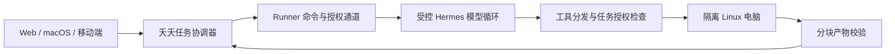

# 受控 Hermes Worker 与 Bot 任务

当前分支已将 Bot 的“隔离电脑”执行方式接入 Runner。用户仍使用原有 Agent、群聊、任务和权限接口；底层使用独立的电脑环境执行工具。

## 执行链路

模型循环进程运行在 Runner 侧，模型凭据仅通过私有进程管道传入。文件、终端、桌面及这些工具启动的进程在 guest 内执行；模型循环不使用原生 Hermes 工具执行分支。隔离电脑不挂载 Hermes 配置、密钥、宿主 HOME 或 Docker socket。

Worker 复用已安装 Hermes 的模型循环。它截获整个工具执行入口，覆盖串行、并行及内联工具分支，只接受本轮注入的工具。未知的 `terminal`、委派或消息工具不能进入宿主原生处理器。模型收到的工具目录只包含当前 Worker 的工具；禁用宿主上下文文件、记忆和后台复核。

## 使用

1. 在“设置 → Hermes 连接 → 执行节点”注册 Runner，选择“启用隔离电脑 Worker”，填写兼容镜像完整 ID、Hermes Python、源码与配置目录。
2. 下载配置后，通过 macOS App 的“执行节点 → 导入节点配置…”连接，或使用 Runner CLI。
3. 将 Agent 的“执行环境”设置为“隔离电脑”。已有普通 Agent 保持原执行方式；执行中不能切换环境。
4. 基础 Profile 必须配置可用于 guest 的绝对 `terminal.cwd`。Runner 读取并解析该配置，将私有工作区映射到相同的 guest 路径。路径相同不代表共享宿主目录。配置变更在下一轮应用，旧电脑身份退役，持久文件保留。

当前 Worker 模型连接支持 Hermes 的 `chat_completions`、`anthropic_messages`、`codex_responses` API 模式；不启动宿主 CLI 模型后端。模型设置和凭据来自允许列表内的 Profile。

## 权限和生命周期

- 控制面在执行节点、账号、基础 Profile、Agent、聊天成员关系和任务状态上共同检查授权。检查发生在命令准入、电脑操作、续期和产物传输时。
- Runner 必须明确声明 `computer-worker-v1` 能力；旧 Runner 或未配置电脑的 Runner 会被拒绝，不会把隔离任务当普通宿主任务运行。
- 电脑租约持有者由服务端生成的调度轮次确定。撤权、停止和连接代次变化结束旧控制权；下一持有者不会复用旧容器 ID。
- 资源不足或 Runner 离线时，未提交的任务排队等待，不重新提交已运行的模型轮次，也不消耗子任务返工次数。
- 普通成员不获得团队管理工具。隔离管理员可以使用当前轮次的团队工具，其新建成员默认继续隔离，不能要求新成员改为宿主执行。
- 模型凭据不进入 guest、进程命令行或日志。macOS App 用系统加密存储保存 Runner 配置。

## 文件和产物

用户附件和分派所需文件通过受控输入写入 guest。`computer_export` 将文件复制为本次导出快照，按块传输，并在控制面校验大小与 SHA-256；每个产物最多 25 MiB，每轮最多 8 个。成功后以正常文件附件出现，支持原有的预览、下载和移动端协议。

产物保留原作者消息和 Profile 归属。任务依赖、管理员复核和结果回传会附上相应文件；转交不会重写原产物来源。隔离消息中的任意路径不会交给宿主 Hermes 文件接口自动读取。

## 已验证

- 真正运行 Hermes 模型循环，测试模型服务返回工具请求；授权工具回到父进程，宿主 `terminal` 请求被拒绝，未产生宿主写入。
- Bot 消息经过完整控制面、Runner、Hermes Worker、真实 Docker，guest UID 1000 写入文件，结果回到原会话。
- 产物进入文件附件，并通过受保护下载接口返回真实内容；验证多块二进制传输及完整大小。
- 同一 Agent 在 Profile cwd 变更后继续执行；停止正在运行的 shell 后未出现延迟写入。
- 隔离管理员通过本轮团队工具创建隔离成员，创建来源记录正确，新成员没有团队管理权限。
- 打包 Runner 的真实 Worker 链路另行执行，验证 Python 入口打包位置及启动方式。

测试模型服务使用确定的协议响应，没有调用付费模型。这些证据证明执行链路与边界，不代表真实模型在任意复杂任务下的自主决策质量。

## 仍需完成

电脑可按节点配置使用受控公网代理，详见 `docs/computer-network.md`。镜像安装/更新、临时助手、屏幕查看/接管、可信团队共享环境，以及移动端执行方式设置等仍属于完整目标的后续工作。现有移动端已可使用服务端创建的隔离 Agent、接收结果和文件，但不能据此宣称完整电脑界面已交付。
