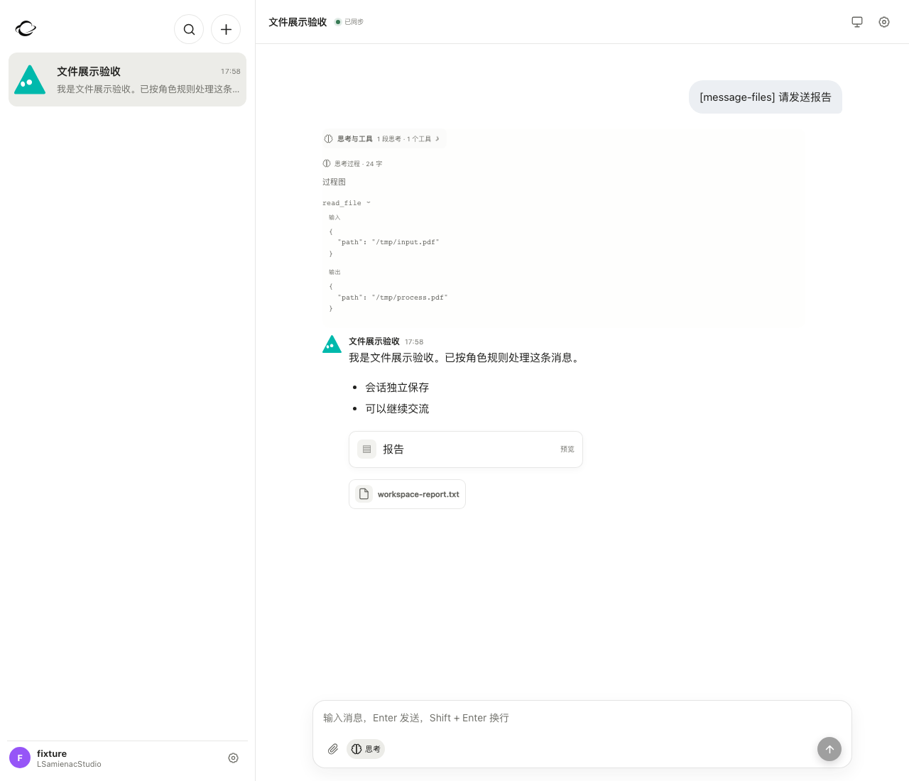

# 聊天文件来源验收

2026-09-09。Web、桌面壳及共享服务端只从聊天正文与明确发送的附件建立文件关联。停止扫描工具事件、工具参数、结果、预览和思考。列表、统计、消息附件查询及历史/实时展示共用规则。历史自动归档关联在读取时按正文核对，原始记录及文件内容保留。用户上传和明确发布到消息的附件继续可用。

## 验证

- `npm run typecheck`、`npm run build` 通过。
- 文件提取/展示、工作区接口、消息缓存等 8 个测试文件共 85 项通过。
- 另执行 messageFiles、workspace、workspaceRemoteAgents、workspacePairedNodes 共 71 项运行时测试通过（其中 messageFiles 的 2 项与上述重叠）。
- Playwright：`npx playwright test -c playwright.workspace.config.ts -g 'only chat messages introduce files'`，1 项通过。
- 隔离 fixture 实测：过程区只有文本、没有图片及文件卡；文件库只返回报告；正文报告可预览，刷新后仍然正确。
- 旧关联回归证明：工具文件仍在磁盘，工具 JSON 未变；正文后来引用同一文件后可重新显示；跨用户隔离保持有效。
- 日志：`/tmp/yaoyao-message-files-web-{typecheck,build,tests,runtime-tests,ui}.log`。

本次没有部署或发布；界面证明使用隔离测试服务，不代表线上服务已更新。

